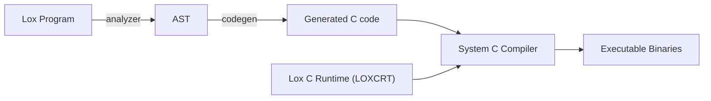

# LoxCC
Lox to C compiler, with corresponding runtime implementation in C.

- [LoxCC](#loxcc)
  - [Motivation](#motivation)
  - [Architecture](#architecture)
  - [Build Configs](#build-configs)

## Motivation
[Lox](https://craftinginterpreters.com/the-lox-language.html), introduced in the book [Crafting Interpreters](https://craftinginterpreters.com), is a language that a lot of PL enthusiasts implement compilers and interpreters for. However:

1. My implementation [rlox](https://github.com/cylixlee/rlox) is not as **fast** as [clox](https://github.com/munificent/craftinginterpreters/tree/master/c)
2. An **AOT** language (with or without additional runtime), instead of JIT/Interpreted language, is what I've been seeking for.

Thus, the LoxCC project is spawned. Similar to *older version of* [Go](https://go.dev/), there will be a C implementation of Lox C Runtime, which is compiled together with Lox programs.

## Architecture

For now, the LoxCC is directly targeting C. The compiler direcly generates corresponding C code, copies the LOXCRT to the output directory, and (optionally) calls the system C compiler. 
> For more compiler behavior, see [build configs](#build-configs).

As the graph describes, the pipeline of compiling a Lox program using LoxCC is as below:
1. **Parse** the source of Lox Program, and creates corresponding AST (Abstract Syntax Tree).
2. **Generate** the AST into C codes.
3. **Copy** the handwritten LOXCRT to the output directory.
4. (optional) **Call** the system C compiler.

## Build Configs

The build configs are written in [YAML](https://yaml.org/), a very expressive serialization language, and placed at the root of LoxCC.

For detailed behavior, see [build-config.yaml](./build-config.yaml)